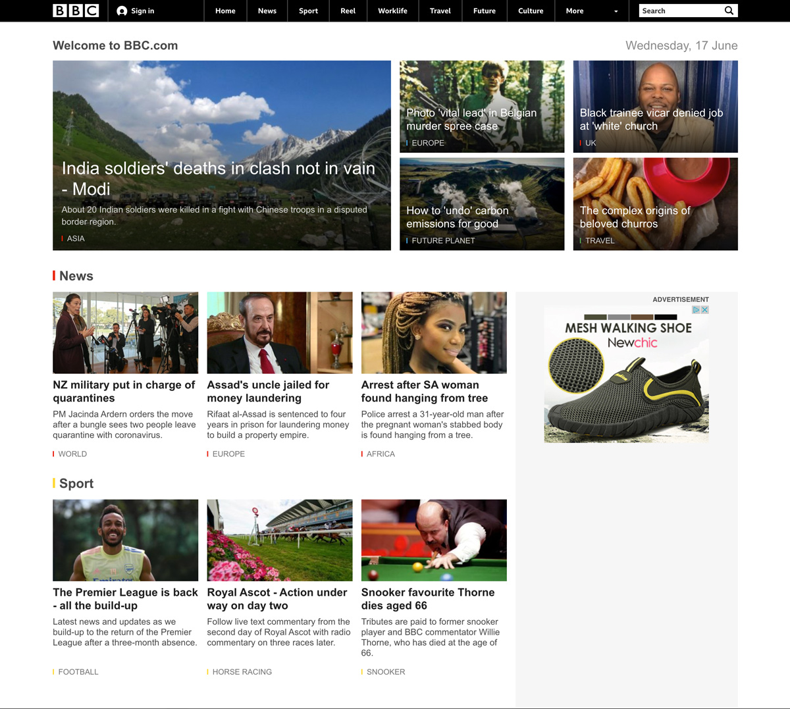

# CSS holiday hackathon

Let's build a BBC homepage clone.

> Attention to detail.

This hackathon is designed to give you practice in CSS, HTML and being detail orientated.

# Rules

Fork this repo, deploy to your domain or github pages, or netlify

## Level 1

CSS and HTML only.

- write your own CSS to build a near pixel perfect version of the BBC homepage
- only build the:
  - header
  - and 2 rows as pictured below in the screenshot.
- use all your knowledge about flex box, position absolute & relative, floats, grids, semantic tags to do so.
- do not copy paste code from the BBC website.
- you may only copy paste some content, article titles and blurbs so you have "real" content in your template.
- do not look at the BBC's CSS or HTML in the console.
- you may only look at the BBC code to get the width, heights, padding sizes, font sizes and colors.
- when you take a screen shot of the real BBC website and we overlay it ontop of your version most things should match.

## Level 2

CSS, HTML, and JavaScript (API).

If you choose to write some vanilla JS please do so, but keep your focus on the UI and the CSS.

here is a cool API you can use: [newsapi.org](https://newsapi.org)

### Screenshot

